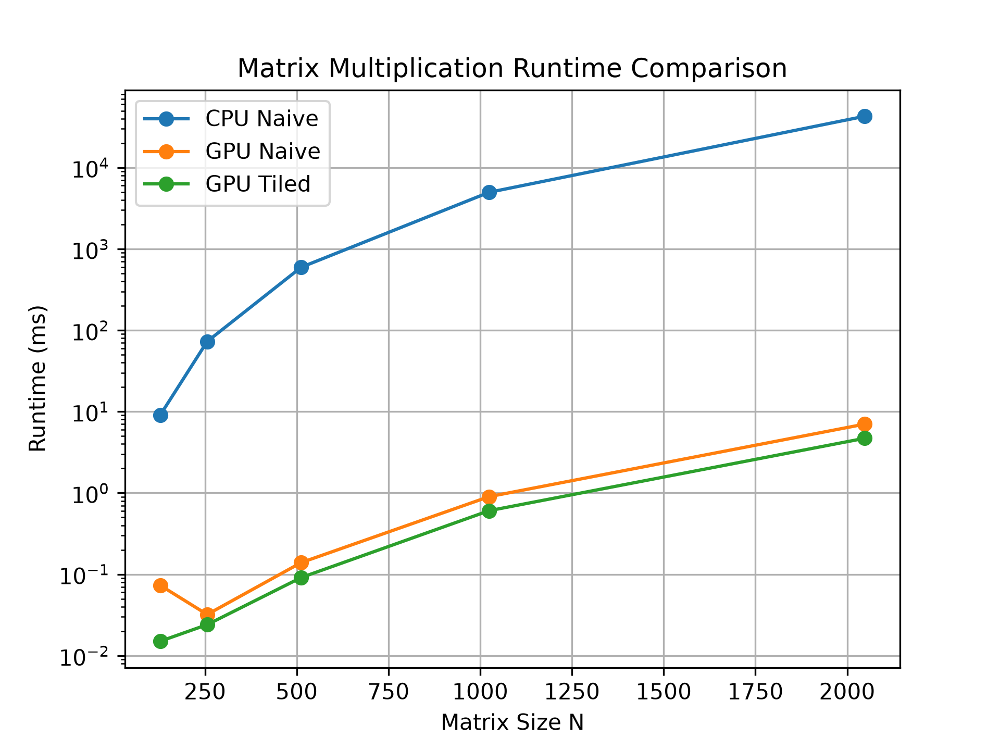
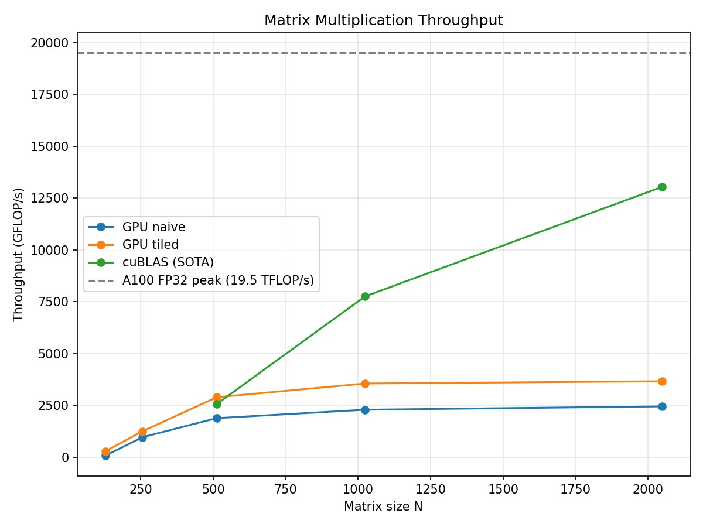

# GPU-Optimized Matrix Multiplication Using CUDA

**Authors:** Sadikshya Satyal, Ayodeji Ibrahim, Muhammad Zahid

## Abstract

This project investigates the performance benefits of GPU acceleration for matrix multiplication using CUDA. A CPU implementation, a naive CUDA implementation, a tiled CUDA implementation using shared memory, and NVIDIA's cuBLAS library were developed and evaluated on the CSC Mahti supercomputer using an NVIDIA A100 GPU. Measured as throughput, the tiled CUDA kernel sustained 3.66 TFLOP/s (approximately 19% of the A100's FP32 peak performance), representing a roughly 1.5× improvement over the naive GPU kernel, while cuBLAS reached 13.0 TFLOP/s (approximately 67% of peak performance). The custom tiled kernel thus achieved roughly 28% of cuBLAS throughput using only shared-memory tiling, demonstrating both the value of memory-hierarchy optimization and the remaining gap between a straightforward CUDA implementation and a highly optimized vendor-provided library.

## 1. Introduction

Matrix multiplication is a fundamental operation in scientific computing, machine learning, computer graphics, and numerical simulations. Due to the independence of individual output elements, matrix multiplication is highly suitable for parallel execution.

The objective of this project is to investigate GPU acceleration using CUDA and evaluate how memory optimization techniques affect performance. Four implementations were compared:

1. CPU Naive Matrix Multiplication
2. Naive CUDA GPU Matrix Multiplication
3. Tiled CUDA GPU Matrix Multiplication using Shared Memory
4. NVIDIA cuBLAS Matrix Multiplication

The project focuses on performance optimization, benchmarking, correctness verification, and comparison against an industry-standard implementation.

## 2. Background

Given matrices A and B, matrix multiplication computes:

C[i][j] = Σ A[i][k] × B[k][j]

Each output element can be computed independently, making the operation naturally parallel.

The naive GPU implementation assigns one thread per output element. Although this exposes significant parallelism, repeated accesses to global memory limit performance.

The tiled implementation improves performance by loading blocks of matrix data into shared memory. Threads within a block reuse these values, reducing expensive global memory accesses and improving memory locality.

NVIDIA cuBLAS was used as a state-of-the-art reference implementation for comparison.

## 3. Implementation

### 3.1 CPU Naive Implementation

The CPU implementation uses three nested loops to compute the matrix product. This implementation serves as the performance baseline.

### 3.2 Naive CUDA Implementation

The naive CUDA kernel assigns one thread to compute each output element. Each thread computes one row-column dot product independently.

### 3.3 Tiled CUDA Implementation

The tiled CUDA implementation utilizes shared memory.

Each block loads tiles of matrices A and B into shared memory and reuses them during computation. This reduces global memory traffic and improves overall efficiency.

A tile size of 16 × 16 was used.

### 3.4 NVIDIA cuBLAS Implementation

To compare against an optimized production-quality solution, NVIDIA's cuBLAS library was used. Matrix multiplication was performed using the `cublasSgemm()` routine.

cuBLAS serves as an industry-standard baseline and demonstrates the performance achievable through highly optimized GPU libraries.

## 4. Experimental Setup

Experiments were executed on the CSC Mahti supercomputer.

### Hardware and Software

* Platform: CSC Mahti
* GPU: NVIDIA A100
* CUDA Version: 11.5
* Programming Language: CUDA C/C++
* Scheduler: Slurm
* Partition: gputest

### Matrix Sizes

* 128 × 128
* 256 × 256
* 512 × 512
* 1024 × 1024
* 2048 × 2048

The following metrics were recorded:

* CPU execution time
* Naive GPU execution time
* Tiled GPU execution time
* cuBLAS execution time
* Speedup relative to CPU
* Correctness verification

## 5. Results

All benchmarks were executed on an NVIDIA A100 GPU on the CSC Mahti supercomputer using CUDA 11.5.

To provide a hardware-oriented performance analysis, throughput was calculated using:

GFLOP/s = (2 × N³) / execution time

where N is the matrix dimension and execution time is measured in seconds.

The theoretical FP32 peak performance of the NVIDIA A100 is approximately 19.5 TFLOP/s.

### 5.1 Runtime Results

|    N |  CPU (ms) | GPU Naive (ms) | GPU Tiled (ms) | cuBLAS (ms) |
| ---: | --------: | -------------: | -------------: | ----------: |
|  128 |     9.146 |          0.062 |          0.015 |    168.628* |
|  256 |    73.919 |          0.035 |          0.027 |     21.019* |
|  512 |   609.954 |          0.143 |          0.093 |       0.105 |
| 1024 |  4941.685 |          0.940 |          0.605 |       0.277 |
| 2048 | 55221.766 |          7.022 |          4.696 |       1.318 |

* The cuBLAS measurements for N = 128 and N = 256 are dominated by one-time library initialization overhead. These values do not represent steady-state cuBLAS performance and are excluded from the throughput analysis.

### 5.2 Throughput Results

|    N | GPU Naive (GFLOP/s) | GPU Tiled (GFLOP/s) | cuBLAS (GFLOP/s) |
| ---: | ------------------: | ------------------: | ---------------: |
|  128 |                67.7 |               279.6 |               —* |
|  256 |               958.7 |              1242.8 |               —* |
|  512 |              1877.2 |              2886.4 |           2556.5 |
| 1024 |              2284.6 |              3549.6 |           7752.6 |
| 2048 |              2446.6 |              3658.4 |          13034.8 |

* Excluded due to initialization overhead.

### 5.3 Fraction of NVIDIA A100 Peak Performance

The following table compares the achieved throughput against the theoretical FP32 peak performance of the NVIDIA A100 GPU (~19.5 TFLOP/s).

| Implementation |    Throughput | Percentage of Peak |
| -------------- | ------------: | -----------------: |
| CPU (serial)   |  0.31 GFLOP/s |              ~0.0% |
| GPU Naive      |  2.45 TFLOP/s |              12.5% |
| GPU Tiled      |  3.66 TFLOP/s |              18.8% |
| cuBLAS         | 13.03 TFLOP/s |              66.8% |

#### Runtime Comparison

#### Speedup Comparison

All implementations produced correct results when verified against the CPU reference implementation.

---

## 6. Discussion

The results clearly demonstrate the effectiveness of GPU acceleration for matrix multiplication.

The serial CPU implementation achieved only approximately 0.3–0.5 GFLOP/s, while the GPU implementations sustained throughput that was two to three orders of magnitude higher. This large difference is expected because matrix multiplication contains abundant data parallelism that can be efficiently distributed across thousands of GPU threads.

The naive CUDA implementation already provided substantial acceleration, reaching approximately 2.45 TFLOP/s for the largest tested matrix size. However, performance was limited by repeated accesses to global memory.

Introducing shared-memory tiling significantly improved performance. At N = 2048, the tiled implementation achieved approximately 3.66 TFLOP/s, representing roughly a 1.5× throughput improvement over the naive GPU implementation. This improvement is primarily due to the reuse of matrix data stored in low-latency shared memory, reducing expensive global memory accesses.

The cuBLAS implementation achieved the highest overall performance, reaching approximately 13.03 TFLOP/s, or 66.8% of the NVIDIA A100's theoretical FP32 peak performance. This result demonstrates the effectiveness of highly optimized vendor-provided libraries.

Although the tiled implementation substantially improved performance over the naive kernel, it achieved approximately 28% of cuBLAS throughput at N = 2048. The remaining performance gap can be attributed to advanced optimizations employed by cuBLAS, including register blocking, vectorized memory accesses, double-buffered tile loading, instruction-level parallelism, and architecture-specific tuning.

Another important observation is that throughput increases rapidly as matrix size grows. For small matrices, the GPU is underutilized because there are too few thread blocks to fully occupy all streaming multiprocessors. Once matrix sizes reach approximately N = 512 and beyond, performance begins to stabilize as the hardware becomes fully utilized.

Overall, the results confirm that shared-memory optimization provides substantial performance benefits and that high-performance GPU libraries such as cuBLAS remain significantly ahead due to their extensive low-level optimizations.

## 7. Conclusion

This project demonstrates how GPU parallelism and memory optimization accelerate matrix multiplication. On an NVIDIA A100, the custom tiled CUDA kernel sustained 3.66 TFLOP/s (approximately 19% of the GPU's theoretical single-precision peak performance), representing roughly a 1.5× improvement over the naive GPU kernel. NVIDIA's cuBLAS library achieved 13.0 TFLOP/s, corresponding to approximately 67% of the A100's FP32 peak performance.

The tiled CUDA implementation achieved approximately 28% of cuBLAS throughput while relying primarily on shared-memory tiling. This result demonstrates the effectiveness of shared-memory optimization while also highlighting the additional techniques employed by highly optimized vendor libraries, including register blocking, vectorized memory accesses, architecture-specific tile shapes, and advanced scheduling strategies.

Overall, the results confirm that matrix multiplication is highly suitable for GPU execution and that memory hierarchy optimization is a critical factor in achieving high performance on modern accelerators.

### Key Findings

* The GPU kernels reached two to three orders of magnitude higher throughput than the serial CPU baseline, which sustained only approximately 0.3–0.5 GFLOP/s.

* Shared-memory tiling improved throughput by roughly 1.5× over the naive GPU kernel (3.66 TFLOP/s versus 2.45 TFLOP/s at N = 2048) by reusing data in low-latency on-chip shared memory rather than repeatedly accessing global memory.

* NVIDIA cuBLAS achieved approximately 67% of the A100's theoretical FP32 peak performance, substantially outperforming the custom tiled kernel. The tiled implementation reached approximately 28% of cuBLAS throughput at N = 2048. The remaining performance gap can be attributed to advanced optimizations employed by cuBLAS, including register blocking, vectorized memory accesses, double-buffered tile loading, and architecture-specific tuning.

* Throughput increased rapidly as matrix size grew and began to plateau around N ≈ 512. For smaller matrices, the GPU is underutilized because there are too few thread blocks to fully occupy all streaming multiprocessors. Performance stabilizes once the workload becomes large enough to saturate the hardware.

* All implementations were verified against the CPU reference implementation and produced correct results.

## 8. Future Work

Future work may include:

* Testing larger matrix sizes
* Implementing OpenMP-based CPU parallelization
* Measuring end-to-end execution times including memory transfers
* Comparing against additional libraries such as CUTLASS and oneMKL
* Exploring different tile sizes
* Profiling using NVIDIA Nsight Compute
